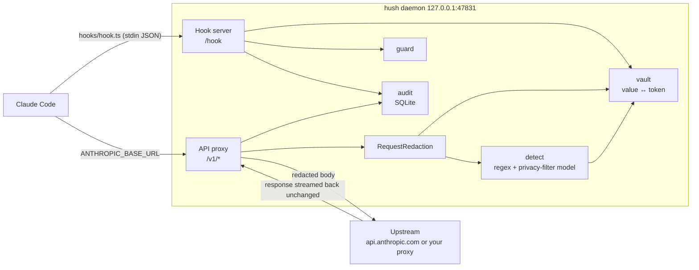
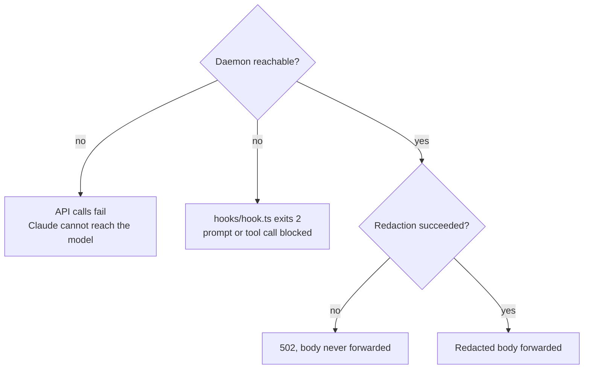

# cc-hush architecture

cc-hush is one Node process that sits between Claude Code and the Anthropic API. It removes PII and secrets from outbound requests, answers Claude Code hooks, guards shell and SQL commands, and keeps a local audit log.

| Page | Covers |
|---|---|
| [Request flow](request-flow.md) | How an API request travels through the proxy and how each message block is redacted |
| [Hooks and guard](hooks-and-guard.md) | UserPromptSubmit, PreToolUse, rehydration, the destructive and PII column passes, fail-closed behaviour |
| [Detection and vault](detection-and-vault.md) | Regex and model detectors, span merging, the token vault |
| [Configuration and storage](configuration-and-storage.md) | Machine config, project config, schema file, files on disk, endpoints |

## Components

## Source map

| File | Role |
|---|---|
| `daemon/server.ts` | HTTP server, routing, `RequestRedaction`, hook handlers, upstream forwarding, audit |
| `daemon/detect.ts` | `regexDetect`, `modelDetect`, `mergeSpans`, `detect`, `mcpKeyPass` |
| `daemon/vault.ts` | `tokenize`, `applySpans`, `redactKnown`, `rehydrate`, `isWhitelisted`, `Policy` |
| `daemon/guard.ts` | `extract`, `destructive`, `piiColumns`, `loadSchema`, `findProject`, `guard` |
| `daemon/service.ts` | startup service per OS (`installService`, `startService`, `uninstallService`), `mergeBaseUrl` for settings.json |
| `daemon/paths.ts` | `~/.cc-hush` data dir, port, token and log paths |
| `bin/cc-hush.ts` | CLI: `install`, `uninstall`, `start [--log]`, `stop`, `status` |
| `plugin/hooks/ensure-daemon.ts` | SessionStart: check the daemon, spawn `cc-hush start` if the service did not, warn when the proxy is not in use |
| `plugin/hooks/hook.ts` | UserPromptSubmit and PreToolUse: forward to `/hook`, exit 2 when the daemon is unreachable |
| `plugin/skills/*/SKILL.md` | Knowledge for Claude: setup, token usage, schema building, PII-free SQL, log review |

## The fail-closed guarantee

Nothing leaves the machine unredacted. Every path that cannot prove redaction stops the request.
