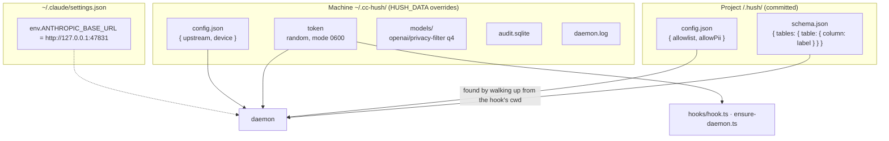
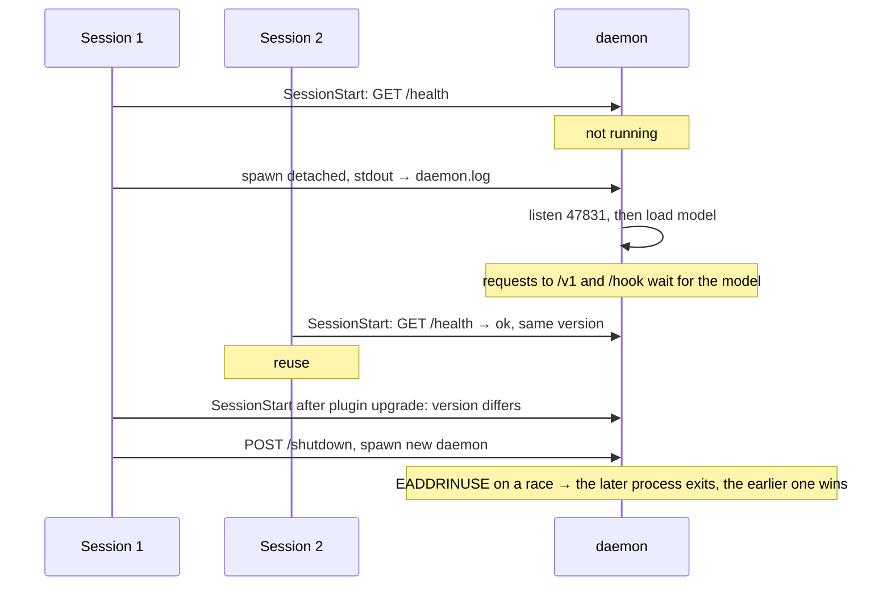

# Configuration and storage

## Where settings live



### Machine config

```json
{ "upstream": "https://api.anthropic.com", "device": "cpu" }
```

| Key | Default | Notes |
|---|---|---|
| `upstream` | `https://api.anthropic.com` | Any Anthropic-compatible base URL, for example another local proxy |
| `device` | `cpu` | `dml` (Windows) or `cuda` where onnxruntime-node finds it; measure first, dml was 2x slower on an Arc iGPU |

Environment overrides for tests: `HUSH_UPSTREAM`, `HUSH_DEVICE`.

### Project config

```json
{
  "allowlist": ["Ewout Van Gossum", "qmino.com"],
  "allowPii": {
    "mcpServers": ["claude_ai_Atlassian_Rovo"],
    "tools": ["Write", "Edit", "MultiEdit"]
  }
}
```

| Key | Default | Effect |
|---|---|---|
| `allowlist` | `[]` | Terms never treated as PII. Exact match or fragment of a term |
| `allowPii.mcpServers` | `[]` | MCP server name prefixes whose inputs receive real values |
| `allowPii.tools` | `Write`, `Edit`, `MultiEdit` | Built-in tools that receive real values. Adding `Bash` is allowed; network commands are still denied |

The proxy resolves the project through the session id in `metadata.user_id` and the `cwd` the hooks recorded. Opening a repo in Claude Code already means accepting its `.claude/settings.json` hooks, so `.hush/config.json` is trusted the same way.

### Schema

Built by the `hush-schema` skill from migrations, ORM models or `information_schema`. Column comments `pii:<label>` win over name heuristics. A file that exists but does not parse makes every SQL command ask until it is fixed.

## Endpoints

| Method and path | Token | Purpose |
|---|---|---|
| `GET /health` | no | `{ ok, version, model: ready\|loading, device, upstream, vault, pid }` |
| `POST /hook` | yes | Hook events, answered fail-closed |
| `GET /debug/vault` | yes | The token map |
| `POST /shutdown` | yes | Exit, used on version upgrade |
| anything else | no | Proxied to `upstream` after redaction |

The token header is `x-hush-token`, value from `~/.cc-hush/token`. Endpoints that reveal or act need it; the proxy does not, since it only removes data.

## Audit log

Table `audit(ts, session_id, event, tool_name, label, count, decision, latency_ms)`. One row per label per event, labels and counts only, never values.

| event | decision values |
|---|---|
| `UserPromptSubmit` | `allow`, `block` |
| `PreToolUse` | `allow`, `ask`, `deny`, each optionally `+rehydrate` |
| `proxy` | `redacted`, `dropped` |

## Daemon lifecycle


