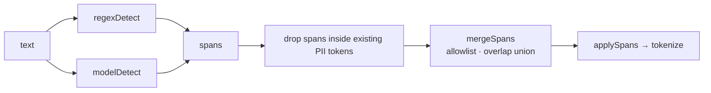
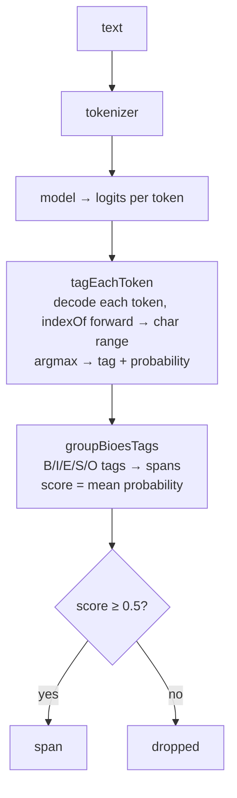
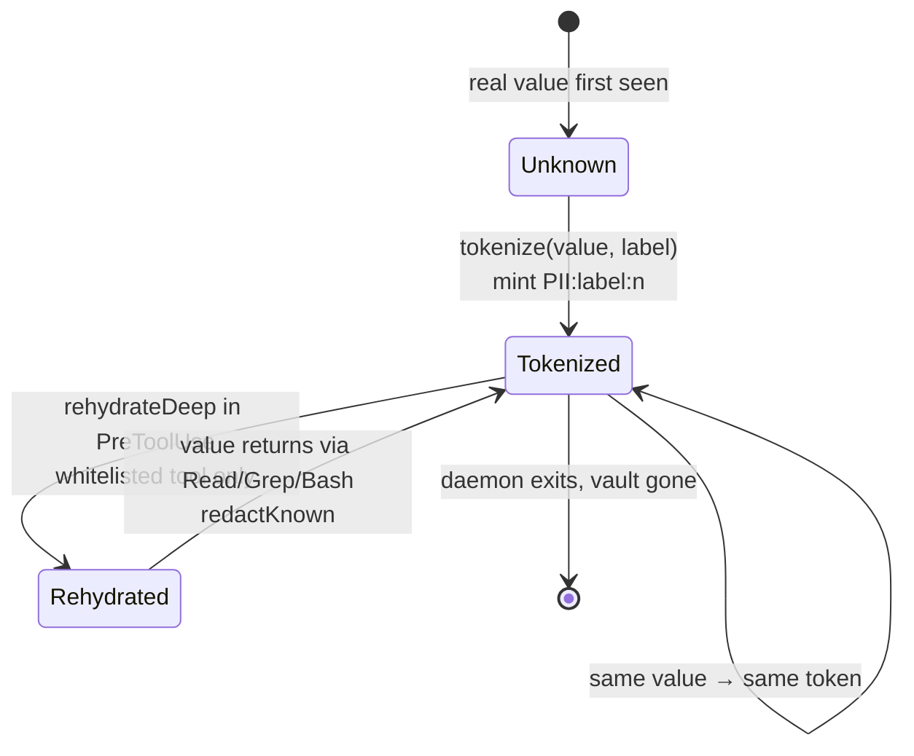
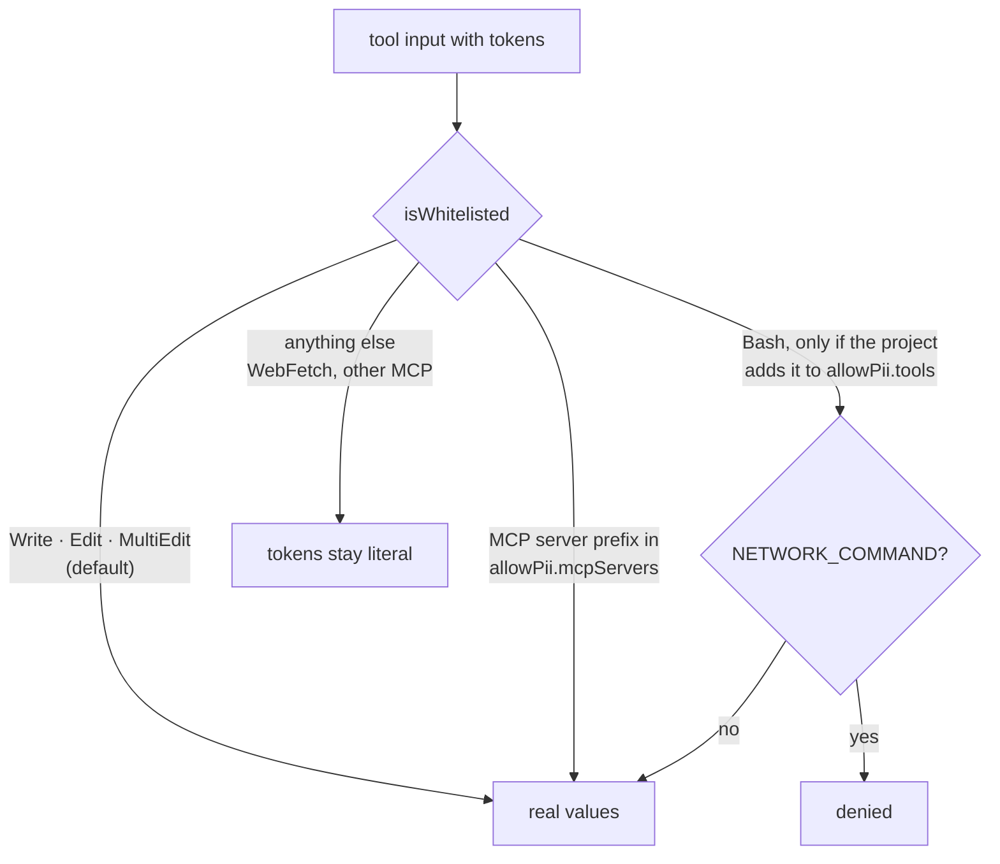

# Detection and vault

## Two detectors, one span list

### regexDetect

Deterministic, score 1, runs on every text including repo-local tool output.

| Constant | Matches | Extra check |
|---|---|---|
| `RIJKSREGISTERNUMMER` | `85.07.30-033.28` | mod 97, with the post-1999 `2` prefix variant |
| `BELGIAN_IBAN` | `BE68 5390 0754 7034` | IBAN mod 97 |
| `BELGIAN_VAT` | `BE0123.456.749` | |
| `BELGIAN_PHONE` | `+32 470 12 34 56` | |
| `AWS_ACCESS_KEY`, `GITHUB_TOKEN`, `GITHUB_FINE_GRAINED_TOKEN`, `SLACK_TOKEN`, `SK_API_KEY`, `JWT`, `PRIVATE_KEY_HEADER` | well-known secret shapes | |
| `SECRET_ASSIGNMENT` | `api_key = "…"`, `password: …` | only the value (capture group 1) is the span |

### modelDetect

`openai/privacy-filter`, 1.5B-parameter mixture of experts with 50M active, q4 ONNX (917 MB), run through `@huggingface/transformers` on onnxruntime-node. Device: `cpu` by default; `dml` or `cuda` when configured. On an Intel Arc Pro 140T, `dml` ran this q4 model 2x slower than `cpu`.

Labels: `account_number`, `private_address`, `private_email`, `private_person`, `private_phone`, `private_url`, `private_date`, `secret`. The model context is 128k tokens, but the ONNX graph materialises attention scores of 14 heads x length squared, so a 26k-token block fails on DirectML and crawls on CPU. Text is therefore scanned in chunks of at most 6000 characters, split at whitespace, with span offsets shifted back; the model's own attention window is 128 tokens, so chunking loses nothing. Identical blocks in flight at the same time share one scan, so a client retry of a body still being redacted does not start a second pass.

### mergeSpans

1. A span is dropped when its text equals an allowlisted term, or is a fragment of one at least 3 characters long (`Van Gossum` for `Ewout Van Gossum`). Containing a term is not enough: `alice@qmino.com` stays PII when only `qmino.com` is allowlisted.
2. Overlapping spans merge into their union. The label follows the highest score.

### mcpKeyPass

Before the model sees an MCP result, a recursive walk tokenizes string values under `emailAddress`, `displayName`, `accountId`, `author`, `reporter`, `assignee`, `creator`, and the `text` of Atlassian `mention` nodes. One function covers Jira, Confluence and GitHub payloads; the model then handles the free text.

## The vault

- One global in-memory map for the daemon's lifetime, shared by every session of the same OS user. Stable tokens keep Anthropic prompt caching intact across turns and sessions.
- Token format `<PII:label:n>` with short labels: `email`, `person`, `phone`, `address`, `account`, `url`, `date`, `secret`.
- Tokens from a previous daemon lifetime do not rehydrate; Claude is told to ask the user to re-provide the value.
- `GET /debug/vault` dumps the map, protected by the local token header.

### Who receives real values

Outputs of whitelisted destinations are still tokenized on the way back in. The whitelist only governs what goes out.
