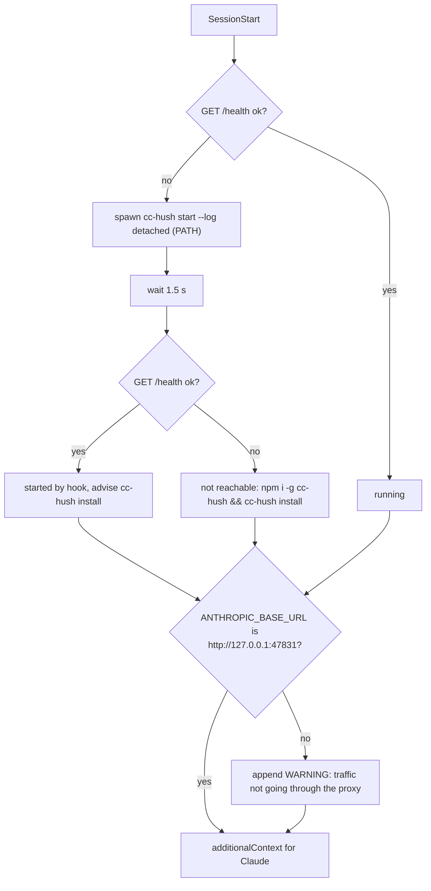
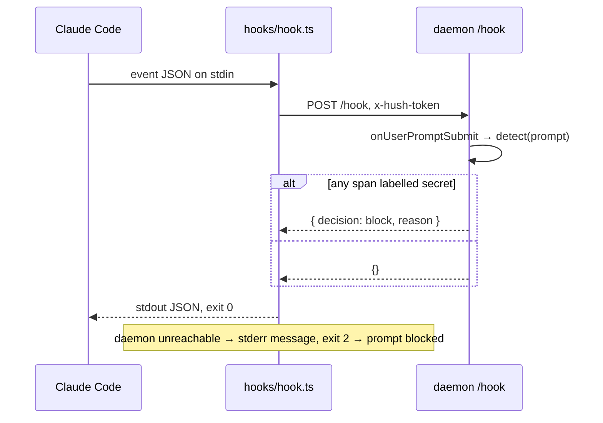
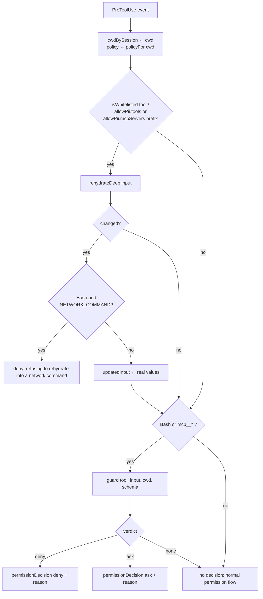
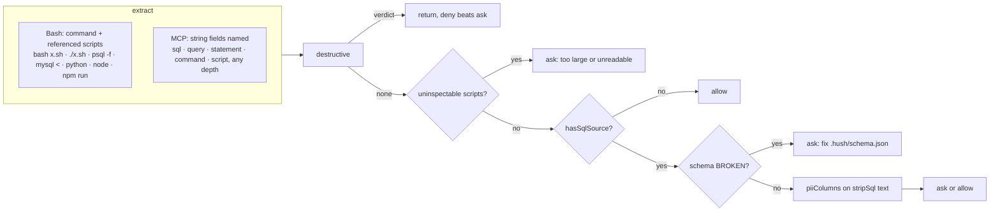

# Hooks and guard

Claude Code runs three hooks from `hooks/hooks.json`. All are command hooks: an unreachable daemon makes `hooks/hook.ts` exit 2, which blocks the prompt or tool call. HTTP hooks were not used because Claude Code treats a failed HTTP hook as "continue".

| Event | Script | Matcher | Outcome |
|---|---|---|---|
| SessionStart | `ensure-daemon.ts` | | check the daemon, start `cc-hush start` as a fallback when the startup service did not, inject two lines of context, warn if `ANTHROPIC_BASE_URL` does not point at the proxy |
| UserPromptSubmit | `hook.ts` | | block when the prompt contains a secret |
| PreToolUse | `hook.ts` | `Bash\|Write\|Edit\|MultiEdit\|mcp__.*` | rehydrate tokens for whitelisted tools, run the guard, return `updatedInput` and a permission decision |

## Session start



## Prompt submit



Only secrets block. Names, emails and other PII pass through the hook and are tokenized by the proxy; the hook API has no prompt-rewrite field.

## Tool use



No `permissionDecision` is returned for a clean call. `updatedInput` applies on its own, and returning `allow` would skip the user's own permission prompt for Write and Edit.

Any exception inside `handleHook` is turned into `deny` (PreToolUse) or `block` (UserPromptSubmit) by `hookResponseFailingClosed`, never into a 5xx.

## The guard



### Destructive tiers

| Tier | Trigger |
|---|---|
| deny | `git push` with `--force`, `-f` or `+ref` targeting `main` or `master`, also `git -C dir push` |
| deny | `DROP table/database/schema/…`, `TRUNCATE` |
| deny | `rm` with `-r` and `-f` on `/`, `~`, `$HOME`, or a drive root |
| ask | any other force push, `rm -rf` elsewhere |
| ask | `UPDATE … SET` or `DELETE FROM` without `WHERE`, `ALTER` |
| ask | `git reset --hard`, `git clean -f`, `git branch -D`, `terraform destroy`, `kubectl delete`, `docker system prune`, `alembic downgrade`, `flyway clean`, `prisma migrate reset`, `Remove-Item -Recurse -Force` |

`stripSql` removes comments and string literals before the WHERE check, so `UPDATE t SET x=1 /* where */` still asks. A quoted chunk that itself contains SQL keywords is kept, because shell commands quote whole statements.

### PII column pass

Runs only when the command is a data source or reads a `.sql` file. With `.hush/schema.json`:

```json
{ "tables": { "customer": { "email": "private_email", "naam": "private_person" } } }
```

| SQL | Result |
|---|---|
| `select * from customer` | ask: SELECT * from a table with PII columns |
| `select c.* from customer c` | ask |
| `select id from customer where email = 'x'` | ask: touches `customer.email` (private_email) |
| `select count(*) from customer` | allow |
| `select emailed from customer` | allow, word boundary |

Identifier matching is enough because the outcome is a permission prompt, never a hard block.
