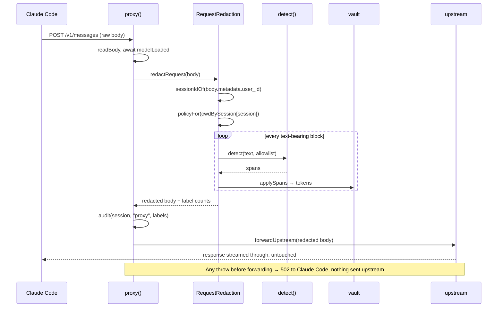
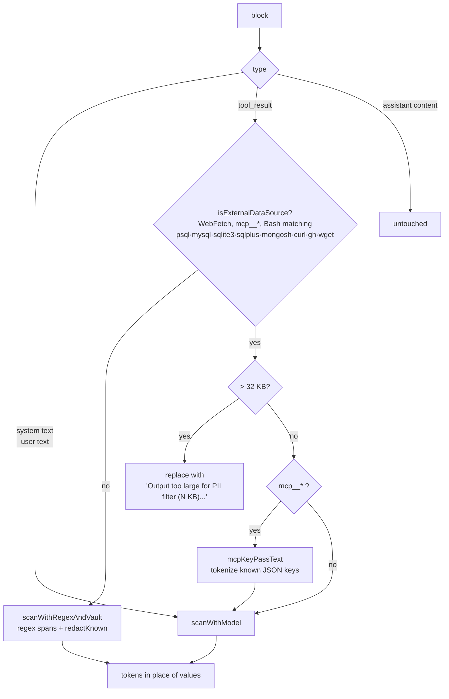
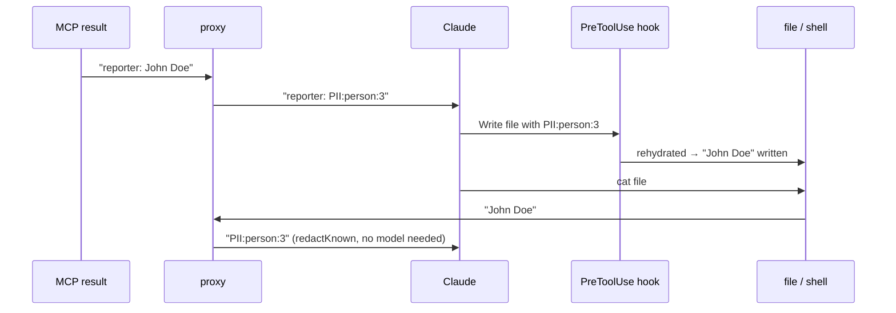

# Request flow

## One API call

The session id lets the proxy pick the right project policy. Claude Code puts `{"session_id": ...}` as a JSON string inside `metadata.user_id`; the hooks recorded that session's `cwd` earlier. An unknown session gets `DEFAULT_POLICY` with an empty allowlist.

## What happens to each block

`RequestRedaction.redactBody` walks `system` and every message. Assistant messages are only read to pair each `tool_result` with the `tool_use` that produced it.

| Block | Treatment | Model |
|---|---|---|
| `system` string or text blocks | full scan, memoized by content hash | yes |
| `role: user` text | full scan, memoized | yes |
| `tool_result` of an external data source | size cap, MCP key pass, full scan | yes |
| every other `tool_result` (Read, Grep, plain Bash) | regex spans, then vault-known values by plain string match | no |
| assistant messages | untouched | |

## Why the cheap pass matters

A value that was rehydrated into a file or command cannot re-enter the API through Read, Grep or Bash output: `redactKnown` swaps every vault-known value back to its token. The regex pass on the same output catches new secrets and Belgian identifiers that never went through the model.

## Memoization

`scanWithModel` caches `sha1(text + allowlist) → redacted text`. Claude Code resends the whole conversation on every turn, so each old block costs one hash lookup and the tokens stay byte-identical, which keeps Anthropic prompt caching intact. The cache is cleared when it passes 50 000 entries.
